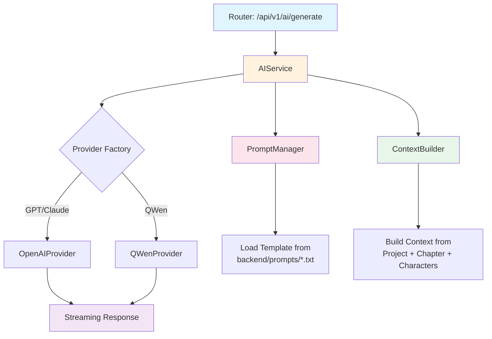
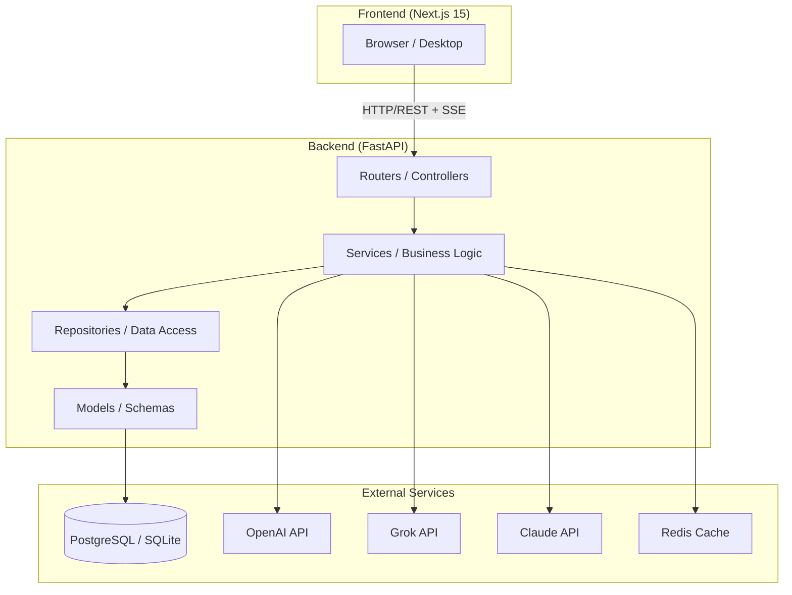
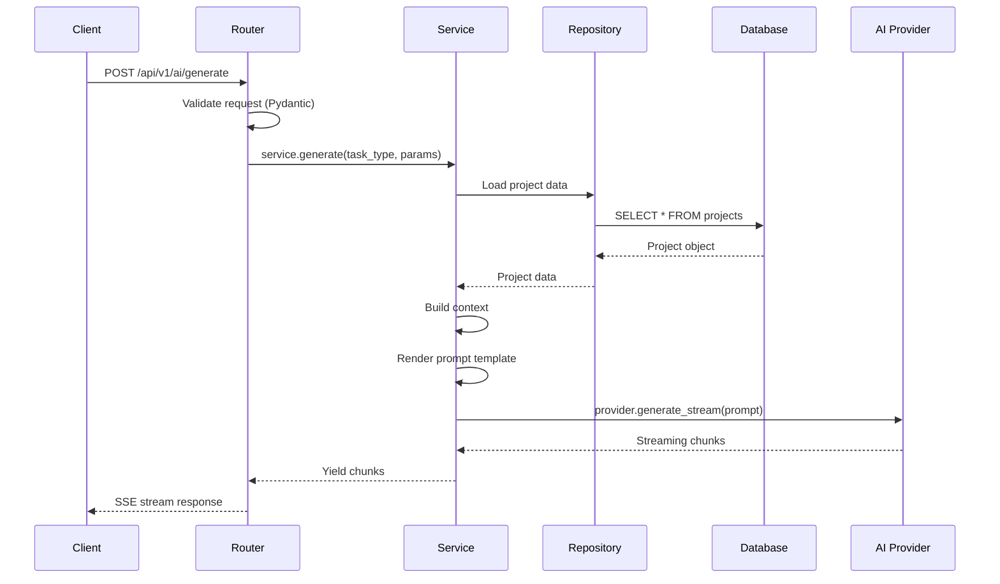
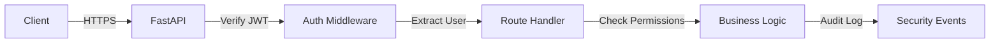
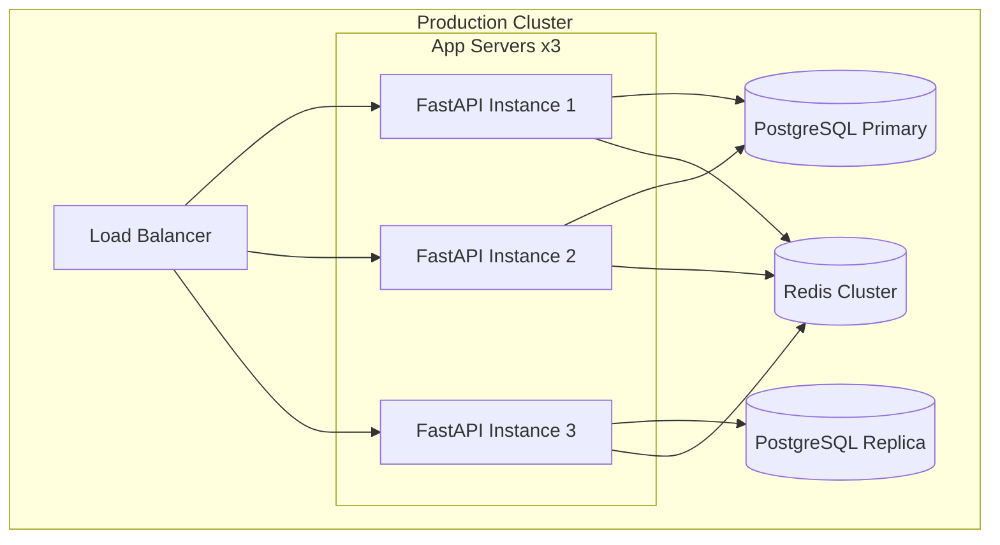

# NovelAI Forge - 模块化标准化开发与维护文档体系

## Context

### 项目当前状态 (2026-04-13)

**已完成的前置工作**:

✅ **Phase 0: 需求分析与架构规划** ([TODO_novelai-forge.md](../TODO_novelai-forge.md))
- Web 全栈架构设计 (Next.js 15 + FastAPI)
- 数据库模型与 API 端点设计
- AI Provider 架构 (OpenAI/Grok/Claude/QWen)
- Docker Compose 开发环境配置

✅ **Phase 1: 桌面版原型** ([TODO_novelai-desktop.md](../TODO_novelai-desktop.md))
- Flet 桌面 GUI 原型
- AI 引擎核心框架
- 提示词模板系统 (6 个模板)

✅ **现有资产**:
- `backend/prompts/` 目录包含 6 个专业提示词模板:
  - `outline_prompt.txt` - 大纲生成
  - `chapter_prompt.txt` - 章节撰写
  - `continuation_prompt.txt` - 续写生成
  - `polish_prompt.txt` - 文本润色
  - `consistency_prompt.txt` - 一致性检查
  - `dialogue_prompt.txt` - 对话生成
- 所有模板使用 `[CUSTOM_SYSTEM_PROMPT_HERE]` 占位符
- 模板变量格式: `{{VARIABLE_NAME}}`
- qwen_bot Selenium 脚本可用于 QWen 模型集成

**Phase 2 当前目标**: 
🎯 **模块化重构 + 标准化开发 + 完整文档体系**

---

### 模块化目标 (Python Backend Focus)

#### 核心原则

1. **分层架构 (Layered Architecture)**
   ```
   Presentation Layer (Routers/Controllers)
        ↓
   Business Logic Layer (Services)
        ↓
   Data Access Layer (Repositories)
        ↓
   Domain Models Layer (Models/Schemas)
   ```

2. **依赖倒置 (Dependency Inversion)**
   - 高层模块不依赖低层模块，都依赖抽象接口
   - 使用 FastAPI `Depends()` 实现依赖注入
   - Service 层通过 Repository 接口访问数据

3. **领域驱动设计 (DDD-inspired)**
   - 按业务域组织代码: auth, projects, novels, ai_generation, consistency
   - 每个域独立封装: routers, services, repositories, schemas, models

4. **标准化 Python 工程实践**
   - Google Style Docstrings
   - Complete Type Hints (Python 3.12+)
   - Pydantic v2 for validation
   - SQLAlchemy 2.0 async style
   - Structured Logging (logging module)
   - Comprehensive Exception Handling

#### 技术栈确认

```
Backend Stack:
├── Framework: FastAPI 0.115+ (async)
├── ORM: SQLAlchemy 2.0+ (async with asyncpg/aiosqlite)
├── Migrations: Alembic 1.13+
├── Validation: Pydantic v2 2.9+
├── Auth: python-jose[cryptography] + passlib[bcrypt]
├── AI: LangChain 0.3+ + OpenAI SDK 1.50+
├── Config: pydantic-settings 2.6+
└── Logging: structlog or logging (standard library)

Frontend Stack:
├── Framework: Next.js 15 (App Router)
├── Language: TypeScript 5.x (strict mode)
├── Styling: Tailwind CSS 3.x + shadcn/ui
├── State: Zustand / React Context
├── HTTP: TanStack Query + Axios
└── Editor: Tiptap / Plate (Rich Text)

Database:
├── Dev: SQLite (aiosqlite)
├── Prod: PostgreSQL 16 (asyncpg)
└── Cache: Redis 7 (optional)
```

---

## Modular Architecture Plan

### NAF-MOD-PLAN-1.1 [Scope & Strategy]

#### 重构范围

**In Scope (必须实现)**:
- ✅ Python Backend 完全模块化重构
- ✅ 分层架构: Routers → Services → Repositories → Models
- ✅ 5 大业务域的完整实现
- ✅ 依赖注入与接口抽象
- ✅ 标准化编码规范
- ✅ 完整的开发文档体系 (6 文档)
- ✅ 完整的维护文档体系 (5 文档)
- ✅ 提示词模板系统集成

**Out of Scope (本次不实现)**:
- ❌ Frontend 完整实现 (仅提供规范指导)
- ❌ Docker/Kubernetes 生产部署
- ❌ CI/CD Pipeline 配置
- ❌ 性能基准测试
- ❌ 国际化 (i18n)
- ❌ 实时协作功能

#### 实施策略

**策略 A: 渐进式重构 (推荐)**


**时间估算 (参考)**:
- Phase 1-2: 基础设施 + Auth = 2-3 天
- Phase 3: Projects 域 = 2 天
- Phase 4: AI Generation 域 = 3-4 天 (最复杂)
- Phase 5-6: Consistency + Export = 2 天
- **总计: ~10-12 人天**

#### 风险评估

| 风险 | 影响 | 概率 | 缓解措施 |
|------|------|------|----------|
| API Breaking Changes | 高 | 中 | 版本化 API (/v1/, /v2/) |
| 数据迁移失败 | 高 | 低 | 备份策略 + 回滚脚本 |
| 提示词模板兼容性 | 中 | 中 | 模板版本控制 |
| 学习曲线陡峭 | 中 | 高 | 详细文档 + Code Examples |
| 性能回归 | 中 | 低 | 基准测试 + Profiling |

---

### NAF-MOD-PLAN-1.2 [Target Directory Structure]

```
novelai-forge/
│
├── backend/                          # 🐍 Python Backend (核心)
│   ├── alembic/                      # Database Migrations
│   │   ├── env.py
│   │   ├── alembic.ini
│   │   └── versions/
│   │       └── 001_initial.py
│   │
│   ├── app/                          # Application Package
│   │   ├── __init__.py
│   │   ├── main.py                   # FastAPI App Factory
│   │   ├── config.py                 # Pydantic Settings
│   │   ├── dependencies.py           # FastAPI Dependency Injection
│   │   │
│   │   ├── core/                     # Core Infrastructure
│   │   │   ├── __init__.py
│   │   │   ├── database.py           # Async Session Management
│   │   │   ├── security.py           # JWT + Password Hashing
│   │   │   ├── logging_config.py     # Structured Logging Setup
│   │   │   └── exceptions.py         # Custom Exception Classes
│   │   │
│   │   ├── models/                   # SQLAlchemy ORM Models
│   │   │   ├── __init__.py
│   │   │   ├── base.py              # Declarative Base
│   │   │   ├── user.py
│   │   │   ├── project.py
│   │   │   ├── chapter.py
│   │   │   ├── character.py
│   │   │   ├── novel_settings.py
│   │   │   └── ai_session.py
│   │   │
│   │   ├── schemas/                  # Pydantic v2 Schemas
│   │   │   ├── __init__.py
│   │   │   ├── common.py            # Common Response Models
│   │   │   ├── user.py
│   │   │   ├── project.py
│   │   │   ├── chapter.py
│   │   │   ├── character.py
│   │   │   ├── ai_generation.py
│   │   │   └── export.py
│   │   │
│   │   ├── repositories/             # Data Access Layer
│   │   │   ├── __init__.py
│   │   │   ├── base.py              # Generic Repository Interface
│   │   │   ├── user_repo.py
│   │   │   ├── project_repo.py
│   │   │   ├── chapter_repo.py
│   │   │   ├── character_repo.py
│   │   │   └── ai_session_repo.py
│   │   │
│   │   ├── services/                 # Business Logic Layer
│   │   │   ├── __init__.py
│   │   │   ├── base.py              # Service Base Class
│   │   │   │
│   │   │   ├── auth/                # Auth Domain
│   │   │   │   ├── __init__.py
│   │   │   │   └── auth_service.py
│   │   │   │
│   │   │   ├── projects/            # Projects Domain
│   │   │   │   ├── __init__.py
│   │   │   │   ├── project_service.py
│   │   │   │   ├── chapter_service.py
│   │   │   │   └── character_service.py
│   │   │   │
│   │   │   ├── ai_generation/       # AI Domain ⭐
│   │   │   │   ├── __init__.py
│   │   │   │   ├── ai_service.py
│   │   │   │   ├── prompt_manager.py
│   │   │   │   ├── providers/
│   │   │   │   │   ├── __init__.py
│   │   │   │   │   ├── base_provider.py
│   │   │   │   │   ├── openai_provider.py
│   │   │   │   │   └── qwen_provider.py
│   │   │   │   └── context_builder.py
│   │   │   │
│   │   │   ├── consistency/         # Consistency Domain
│   │   │   │   ├── __init__.py
│   │   │   │   └── consistency_service.py
│   │   │   │
│   │   │   └── export/              # Export Domain
│   │   │       ├── __init__.py
│   │   │       └── export_service.py
│   │   │
│   │   └── routers/                  # API Route Handlers
│   │       ├── __init__.py
│   │       ├── auth.py
│   │       ├── projects.py
│   │       ├── chapters.py
│   │       ├── characters.py
│   │       ├── ai.py
│   │       └── export.py
│   │
│   ├── prompts/                      # AI Prompt Templates ⭐
│   │   ├── README.md
│   │   ├── outline_prompt.txt
│   │   ├── chapter_prompt.txt
│   │   ├── continuation_prompt.txt
│   │   ├── polish_prompt.txt
│   │   ├── consistency_prompt.txt
│   │   ├── dialogue_prompt.txt
│   │   └── custom/
│   │
│   ├── tests/                        # Test Suite
│   │   ├── __init__.py
│   │   ├── conftest.py
│   │   ├── unit/
│   │   │   ├── test_services/
│   │   │   ├── test_repositories/
│   │   │   └── test_schemas/
│   │   └── integration/
│   │       ├── test_api/
│   │       └── test_ai/
│   │
│   ├── scripts/                      # Utility Scripts
│   │   ├── init_db.py
│   │   ├── seed_data.py
│   │   └── migrate_prompts.py
│   │
│   ├── requirements.txt
│   ├── requirements-dev.txt
│   ├── pyproject.toml                # Python Project Metadata
│   ├── .env.example
│   └── Dockerfile
│
├── frontend/                         # Next.js Frontend (次要)
│   └── ...                           # (结构见 CODING-STANDARDS.md)
│
├── docs/                             # 📚 Documentation Hub
│   ├── development/                  # Development Docs
│   │   ├── ARCHITECTURE.md
│   │   ├── API.md
│   │   ├── DATABASE.md
│   │   ├── AI-PROMPTS.md
│   │   ├── SETUP.md
│   │   └── CODING-STANDARDS.md
│   │
│   └── maintenance/                  # Maintenance Docs
│       ├── MAINTENANCE.md
│       ├── TROUBLESHOOTING.md
│       ├── PROMPT-CUSTOMIZATION-GUIDE.md
│       ├── SCALING.md
│       └── CHANGELOG.md
│
├── docker-compose.yml
├── docker-compose.prod.yml
├── .env.example
├── .gitignore
├── README.md
└── TODO_novelai-modular-docs.md      # 本文档
```

---

### NAF-MOD-PLAN-1.3 [Layer Contracts & Interfaces]

#### 接口定义标准

```python
# 示例: Repository 接口定义
from typing import TypeVar, Generic, List, Optional
from sqlalchemy.ext.asyncio import AsyncSession

T = TypeVar('T')

class BaseRepository(Generic[T]):
    """
    Generic repository interface for data access operations.
    
    This abstract class defines the contract that all concrete repositories
    must implement. It provides CRUD operations and common query patterns.
    
    Attributes:
        model: The SQLAlchemy model class this repository manages.
        session: The async database session.
    
    Example:
        >>> class UserRepository(BaseRepository[User]):
        ...     model = User
        ...     
        >>> async with get_session() as session:
        ...     repo = UserRepository(session)
        ...     user = await repo.get_by_id(123)
    """
    
    model: type[T]
    
    def __init__(self, session: AsyncSession) -> None:
        """Initialize repository with database session."""
        ...
    
    async def get_by_id(self, id: int) -> Optional[T]:
        """Retrieve a single entity by its primary key."""
        ...
    
    async def get_all(
        self, 
        skip: int = 0, 
        limit: int = 100,
        **filters
    ) -> List[T]:
        """Retrieve multiple entities with pagination and filtering."""
        ...
    
    async def create(self, entity: T) -> T:
        """Persist a new entity to the database."""
        ...
    
    async def update(self, id: int, data: dict) -> Optional[T]:
        """Update an existing entity."""
        ...
    
    async def delete(self, id: int) -> bool:
        """Remove an entity from the database."""
        ...

# 示例: Service 接口定义
class BaseService(Generic[T]):
    """
    Base service class implementing business logic.
    
    Services orchestrate repository calls and implement domain-specific
    rules. They should not contain HTTP-specific logic.
    """
    
    def __init__(self, repository: BaseRepository[T]) -> None:
        """Initialize service with injected repository."""
        ...
    
    async def get_one(self, id: int) -> T:
        """Get single item with business rule validation."""
        ...
    
    async def create_item(self, schema: PydanticModel) -> T:
        """Create item with business logic."""
        ...
```

---

## Task Items

### NAF-MOD-ITEM-1.0 [基础设施层搭建]

#### 任务描述
建立项目基础骨架，包括配置管理、数据库连接、日志系统、异常处理等跨领域关注点。

#### 子任务清单

- [ ] **NAF-MOD-ITEM-1.0.1 [创建项目目录结构]**
  
  ```bash
  # 创建完整的后端目录树
  cd backend
  
  mkdir -p app/{core,models,schemas,repositories,services/{auth,projects,ai_generation,consistency,export},routers}
  mkdir -p app/services/ai_generation/providers
  mkdir -p tests/{unit/{test_services,test_repositories,test_schemas},integration/{test_api,test_ai}}
  mkdir -p prompts/custom scripts
  mkdir -p ../../docs/{development,maintenance}
  
  # 创建所有 __init__.py 文件
  find app tests -type d -exec touch {}/__init__.py \;
  ```

- [ ] **NAF-MOD-ITEM-1.0.2 [配置管理 - config.py]**

  ```python
  """
  Application configuration using Pydantic Settings.
  
  This module centralizes all configuration parameters, loading from
  environment variables with sensible defaults. Supports both development
  and production environments.
  
  Usage:
      from app.config import settings
      
      print(settings.DATABASE_URL)
      print(settings.OPENAI_API_KEY)
  """

  from functools import lru_cache
  from pydantic_settings import BaseSettings
  from typing import Optional


  class Settings(BaseSettings):
      """
      Application settings loaded from environment variables.
      
      All settings can be overridden via environment variables or .env file.
      See .env.example for all available options.
      """
      
      # Application
      APP_NAME: str = "NovelAI Forge"
      APP_VERSION: str = "1.0.0"
      DEBUG: bool = False
      ENVIRONMENT: str = "development"  # development | staging | production
      
      # Server
      HOST: str = "0.0.0.0"
      PORT: int = 8000
      CORS_ORIGINS: list[str] = ["http://localhost:3000"]
      
      # Database
      DATABASE_URL: str = "sqlite+aiosqlite:///./dev.db"
      DATABASE_ECHO: bool = False
      POOL_SIZE: int = 5
      MAX_OVERFLOW: int = 10
      
      # Authentication
      SECRET_KEY: str = "your-super-secret-key-change-in-production"
      ALGORITHM: str = "HS256"
      ACCESS_TOKEN_EXPIRE_MINUTES: int = 30
      
      # AI Providers
      OPENAI_API_KEY: Optional[str] = None
      OPENAI_BASE_URL: Optional[str] = None
      GROK_API_KEY: Optional[str] = None
      CLAUDE_API_KEY: Optional[str] = None
      QWEN_EMAIL: Optional[str] = None
      QWEN_PASSWORD: Optional[str] = None
      
      # AI Defaults
      DEFAULT_AI_MODEL: str = "gpt-4o"
      AI_TEMPERATURE: float = 0.7
      AI_MAX_TOKENS: int = 4000
      
      # Redis (optional)
      REDIS_URL: Optional[str] = None
      
      # Paths
      PROMPTS_DIR: str = "backend/prompts"
      EXPORT_DIR: str = "exports"
      
      class Config:
          env_file = ".env"
          env_file_encoding = "utf-8"
          case_sensitive = True


  @lru_cache()
  def get_settings() -> Settings:
      """
      Get cached application settings.
      
      Uses lru_cache to ensure settings are only loaded once.
      Call this function throughout the application instead of
      instantiating Settings directly.
      
      Returns:
          Settings: Cached application configuration.
      """
      return Settings()


  # Global settings instance
  settings = get_settings()
  ```

- [ ] **NAF-MOD-ITEM-1.0.3 [数据库连接 - core/database.py]**

  ```python
  """
  Asynchronous database session management.
  
  Provides async engine and session factory for SQLAlchemy 2.0.
  Supports both SQLite (development) and PostgreSQL (production).
  """

  from sqlalchemy.ext.asyncio import (
      create_async_engine,
      AsyncSession,
      async_sessionmaker,
      AsyncEngine,
  )
  from sqlalchemy.orm import DeclarativeBase
  from app.config import settings
  
  
  class Base(DeclarativeBase):
      """
      Declarative base for all SQLAlchemy models.
      
      All ORM models should inherit from this class to ensure
      they are registered with the metadata.
      """
      pass
  
  
  engine: AsyncEngine = create_async_engine(
      settings.DATABASE_URL,
      echo=settings.DATABASE_ECHO,
      pool_size=settings.POOL_SIZE,
      max_overflow=settings.MAX_OVERFLOW,
      pool_pre_ping=True,  # Enable connection health checks
  )
  
  AsyncSessionLocal = async_sessionmaker(
      engine,
      class_=AsyncSession,
      expire_on_commit=False,
      autocommit=False,
      autoflush=False,
  )
  
  
  async def get_db() -> AsyncSession:
      """
      Dependency that provides a database session.
      
      Yields an async session and ensures it's closed after use.
      Use this as a FastAPI dependency in route handlers.
      
      Yields:
          AsyncSession: Database session for the request lifecycle.
          
      Example:
          @router.get("/users")
          async def get_users(db: AsyncSession = Depends(get_db)):
              return await db.execute(select(User)).scalars().all()
      """
      async with AsyncSessionLocal() as session:
          try:
              yield session
              await session.commit()
          except Exception:
              await session.rollback()
              raise
          finally:
              await session.close()
  ```

- [ ] **NAF-MOD-ITEM-1.0.4 [日志配置 - core/logging_config.py]**

  ```python
  """
  Structured logging configuration.
  
  Sets up Python's logging module with consistent formatting,
  log levels, and output handlers for both development and production.
  """

  import logging
  import sys
  from app.config import settings
  
  
  def setup_logging() -> None:
      """
      Configure application-wide logging.
      
      Creates a root logger with appropriate handlers based on
      the current environment (development vs production).
      
      In development: Colorful console output with DEBUG level.
      In production: JSON-formatted output with INFO level.
      """
      log_level = logging.DEBUG if settings.DEBUG else logging.INFO
      
      # Create formatter
      if settings.DEBUG:
          formatter = logging.Formatter(
              fmt="%(asctime)s | %(levelname)-8s | %(name)s | %(funcName)s:%(lineno)d | %(message)s",
              datefmt="%Y-%m-%d %H:%M:%S",
          )
      else:
          formatter = logging.Formatter(
              fmt='{"timestamp":"%(asctime)s","level":"%(levelname)s","logger":"%(name)s","message":"%(message)s"}',
              datefmt="%Y-%m-%dT%H:%M:%S",
          )
      
      # Console handler
      console_handler = logging.StreamHandler(sys.stdout)
      console_handler.setLevel(log_level)
      console_handler.setFormatter(formatter)
      
      # Configure root logger
      root_logger = logging.getLogger()
      root_logger.setLevel(log_level)
      root_logger.addHandler(console_handler)
      
      # Reduce noise from third-party libraries
      logging.getLogger("uvicorn.access").setLevel(logging.WARNING)
      logging.getLogger("sqlalchemy.engine").setLevel(logging.WARNING)
      logging.getLogger("httpx").setLevel(logging.WARNING)
      logging.getLogger("openai").setLevel(logging.WARNING)
      logging.getLogger("langchain").setLevel(logging.WARNING)
      
      logging.info("Logging configured successfully")
  
  
  def get_logger(name: str) -> logging.Logger:
      """
      Get a logger instance for a specific module.
      
      Args:
          name: Typically __name__ of the calling module.
          
      Returns:
          Logger: Configured logger instance.
      """
      return logging.getLogger(name)
  ```

- [ ] **NAF-MOD-ITEM-1.0.5 [自定义异常 - core/exceptions.py]**

  ```python
  """
  Custom exception classes for domain-specific errors.
  
  Provides structured error responses with HTTP status codes
  and detailed error information for API clients.
  """

  from typing import Any, Dict, Optional
  
  
  class NovelAIForgeError(Exception):
      """
      Base exception for all application-specific errors.
      
      Attributes:
          message: Human-readable error description.
          status_code: HTTP status code to return.
          details: Additional error context.
      """
      
      def __init__(
          self,
          message: str = "An unexpected error occurred",
          status_code: int = 500,
          details: Optional[Dict[str, Any]] = None,
      ) -> None:
          super().__init__(message)
          self.message = message
          self.status_code = status_code
          self.details = details or {}
      
      def to_dict(self) -> Dict[str, Any]:
          """Convert exception to dictionary for JSON response."""
          return {
              "error": self.__class__.__name__,
              "message": self.message,
              "status_code": self.status_code,
              "details": self.details,
          }
  
  
  class NotFoundError(NovelAIForgeError):
      """Raised when a requested resource is not found."""
      
      def __init__(self, resource_type: str, resource_id: Any) -> None:
          message = f"{resource_type} with id '{resource_id}' not found"
          super().__init__(message=message, status_code=404)
          self.resource_type = resource_type
          self.resource_id = resource_id
  
  
  class ValidationError(NovelAIForgeError):
      """Raised when input data fails validation."""
      
      def __init__(self, message: str, field_errors: Optional[Dict] = None) -> None:
          super().__init__(message=message, status_code=422, details=field_errors)
  
  
  class AuthenticationError(NovelAIForgeError):
      """Raised when authentication fails."""
      
      def __init__(self, message: str = "Invalid credentials") -> None:
          super().__init__(message=message, status_code=401)
  
  
  class AuthorizationError(NovelAIForgeError):
      """Raised when user lacks permission for an action."""
      
      def __init__(self, action: str) -> None:
          message = f"Insufficient permissions to perform: {action}"
          super().__init__(message=message, status_code=403)
  
  
  class AIProviderError(NovelAIForgeError):
      """Raised when AI generation fails."""
      
      def __init__(
          self,
          provider: str,
          message: str = "AI provider request failed",
          original_error: Optional[Exception] = None,
      ) -> None:
          super().__init__(message=message, status_code=502)
          self.provider = provider
          self.original_error = original_error
          self.details["provider"] = provider
  
  
  class PromptTemplateError(NovelAIForgeError):
      """Raised when prompt template is missing or invalid."""
      
      def __init__(self, template_name: str, reason: str = "not found") -> None:
          message = f"Prompt template '{template_name}' {reason}"
          super().__init__(message=message, status_code=500)
          self.template_name = template_name
  ```

---

### NAF-MOD-ITEM-2.0 [Auth 域实现]

#### 任务描述
实现用户认证与授权功能，包括注册、登录、JWT Token 管理。

#### 核心文件

- [ ] **NAF-MOD-ITEM-2.0.1 [User Model - models/user.py]**

  ```python
  """
  User model definition.
  
  Represents authenticated users of the system with their
  credentials and profile information.
  """

  from datetime import datetime
  from sqlalchemy import String, Boolean, DateTime, func
  from sqlalchemy.orm import Mapped, mapped_column
  from app.models.base import Base
  
  
  class User(Base):
      """
      User account model.
      
      Stores authentication credentials (hashed password),
      profile data, and timestamps.
      
      Attributes:
          id: Primary key.
          email: Unique email address (login identifier).
          hashed_password: BCrypt hash of user's password.
          is_active: Whether account is enabled.
          is_superuser: Admin privileges flag.
          created_at: Account creation timestamp.
          updated_at: Last update timestamp.
      """
      
      __tablename__ = "users"
      
      id: Mapped[int] = mapped_column(primary_key=True, autoincrement=True)
      email: Mapped[str] = mapped_column(
          String(255), unique=True, index=True, nullable=False
      )
      hashed_password: Mapped[str] = mapped_column(String(255), nullable=False)
      full_name: Mapped[str] = mapped_column(String(255), nullable=True)
      is_active: Mapped[bool] = mapped_column(Boolean, default=True)
      is_superuser: Mapped[bool] = mapped_column(Boolean, default=False)
      created_at: Mapped[datetime] = mapped_column(
          DateTime(timezone=True), server_default=func.now()
      )
      updated_at: Mapped[datetime] = mapped_column(
          DateTime(timezone=True), server_default=func.now(), onupdate=func.now()
      )
      
      def __repr__(self) -> str:
          return f"<User(id={self.id}, email='{self.email}')>"
  ```

- [ ] **NAF-MOD-ITEM-2.0.2 [Auth Service - services/auth/auth_service.py]**

  ```python
  """
  Authentication business logic service.
  
  Handles user registration, login, token generation,
  and credential verification.
  """

  from datetime import timedelta, datetime, timezone
  from typing import Optional
  
  from jose import jwt, JWTError
  from passlib.context import CryptContext
  from sqlalchemy.ext.asyncio import AsyncSession
      from sqlalchemy import select
      
  from app.core.security import (
          verify_password,
          get_password_hash,
          create_access_token,
      )
  from app.core.exceptions import (
          AuthenticationError,
          ValidationError,
          NotFoundError,
      )
  from app.models.user import User
  from app.schemas.user import UserCreate, UserLogin, TokenResponse
  from app.repositories.user_repo import UserRepository
  from app.config import settings
  from app.core.logging_config import get_logger
  
  logger = get_logger(__name__)
  
  
  class AuthService:
      """
      Service for authentication operations.
      
      Orchestrates user CRUD with security considerations
      like password hashing and JWT token management.
      """
      
      def __init__(self, user_repository: UserRepository) -> None:
          """
          Initialize auth service with dependencies.
          
          Args:
              user_repository: Data access layer for users.
          """
          self.user_repo = user_repository
      
      async def register_user(
          self, 
          user_data: UserCreate, 
          db: AsyncSession
      ) -> User:
          """
          Register a new user account.
          
          Validates email uniqueness, hashes password,
          and persists user to database.
          
          Args:
              user_data: Validated registration data.
              db: Database session.
              
          Returns:
              User: Newly created user (without password).
              
          Raises:
              ValidationError: If email already exists.
          """
          logger.info(f"Attempting to register user: {user_data.email}")
          
          # Check existing user
          existing = await self.user_repo.get_by_email(user_data.email, db)
          if existing:
              raise ValidationError(
                  message="Email already registered",
                  field_errors={"email": "This email is already in use"}
              )
          
          # Hash password
          hashed_pw = get_password_hash(user_data.password)
          
          # Create user
          new_user = User(
              email=user_data.email,
              hashed_password=hashed_pw,
              full_name=user_data.full_name,
          )
          
          created_user = await self.user_repo.create(new_user, db)
          
          logger.info(f"User registered successfully: {created_user.id}")
          return created_user
      
      async def authenticate_user(
          self, 
          credentials: UserLogin, 
          db: AsyncSession
      ) -> TokenResponse:
          """
          Authenticate user and issue JWT token.
          
          Verifies credentials and returns access token
          with expiration time.
          
          Args:
              credentials: Email and password.
              db: Database session.
              
          Returns:
              TokenResponse: Contains access_token and token_type.
              
          Raises:
              AuthenticationError: If credentials invalid.
          """
          logger.info(f"Authentication attempt: {credentials.email}")
          
          user = await self.user_repo.get_by_email(credentials.email, db)
          
          if not user or not verify_password(credentials.password, user.hashed_password):
              logger.warning(f"Failed login attempt: {credentials.email}")
              raise AuthenticationError("Invalid email or password")
          
          if not user.is_active:
              raise AuthenticationError("Account is disabled")
          
          # Generate JWT
          token_expires = timedelta(minutes=settings.ACCESS_TOKEN_EXPIRE_MINUTES)
          access_token = create_access_token(
              data={"sub": user.email, "user_id": user.id},
              expires_delta=token_expires,
          )
          
          logger.info(f"User authenticated: {user.id}")
          
          return TokenResponse(
              access_token=access_token,
              token_type="bearer",
              expires_in=settings.ACCESS_TOKEN_EXPIRE_MINUTES * 60,
          )
      
      async def get_current_user(
          self, 
          token: str, 
          db: AsyncSession
      ) -> User:
          """
          Validate JWT and retrieve current user.
          
          Decodes token, extracts user ID, fetches user
          from database.
          
          Args:
              token: JWT bearer token.
              db: Database session.
              
          Returns:
              User: Current authenticated user.
              
          Raises:
              AuthenticationError: If token invalid/expired.
          """
          try:
              payload = jwt.decode(
                  token, 
                  settings.SECRET_KEY, 
                  algorithms=[settings.ALGORITHM]
              )
              user_id: int = payload.get("user_id")
              
              if user_id is None:
                  raise AuthenticationError("Invalid token payload")
                  
          except JWTError as e:
              logger.error(f"Token decode failed: {e}")
              raise AuthenticationError("Could not validate credentials")
          
          user = await self.user_repo.get_by_id(user_id, db)
          if user is None:
              raise AuthenticationError("User not found")
          
          return user
  ```

---

### NAF-MOD-ITEM-3.0 [Projects 域实现]

#### 任务描述
实现小说项目管理，包括项目CRUD、章节管理、角色管理。

#### 关键组件

- [ ] **NAF-MOD-ITEM-3.0.1 [Project Model & Schema]**
- [ ] **NAF-MOD-ITEM-3.0.2 [Chapter Model & Schema]**
- [ ] **NAF-MOD-ITEM-3.0.3 [Character Model & Schema]**
- [ ] **NAF-MOD-ITEM-3.0.4 [ProjectService - 业务逻辑]**
- [ ] **NAF-MOD-ITEM-3.0.5 [ProjectRouter - API端点]**

---

### NAF-MOD-ITEM-4.0 [AI Generation 域实现] ⭐ 核心

#### 任务描述
实现 AI 内容生成的核心引擎，包括提示词管理、多 Provider 支持、流式输出。

#### 架构示意



#### 核心文件清单

- [ ] **NAF-MOD-ITEM-4.0.1 [PromptManager - services/ai_generation/prompt_manager.py]**

  ```python
  """
  AI Prompt Template Manager.
  
  Loads, caches, and renders prompt templates from the
  backend/prompts/ directory. All custom system prompts
  are loaded from external files - never hardcoded.
  """

  import os
  from pathlib import Path
  from typing import Tuple, Dict, Any, Optional
  from jinja2 import Environment, FileSystemLoader, TemplateNotFound
  
  from app.config import settings
  from app.core.exceptions import PromptTemplateError
  from app.core.logging_config import get_logger
  
  logger = get_logger(__name__)
  
  
  class PromptTemplateManager:
      """
      Manages AI prompt templates with Jinja2 rendering.
      
      Templates are stored in backend/prompts/ as .txt files.
      Each template contains:
      - [CUSTOM_SYSTEM_PROMPT_HERE] placeholder for system instructions
      - {{VARIABLE}} placeholders for dynamic content
      - [User Input] marker separating context from user query
      
      Supported template types:
          - outline: Novel outline generation
          - chapter: Chapter writing
          - continuation: Story continuation
          - polish: Text polishing/refinement
          - consistency: Consistency checking
          - dialogue: Dialogue generation
      """
      
      TEMPLATE_MAPPING = {
          "outline": "outline_prompt.txt",
          "chapter": "chapter_prompt.txt",
          "continuation": "continuation_prompt.txt",
          "polish": "polish_prompt.txt",
          "consistency": "consistency_prompt.txt",
          "dialogue": "dialogue_prompt.txt",
      }
      
      SYSTEM_PROMPT_MARKER = "[CUSTOM_SYSTEM_PROMPT_HERE]"
      USER_INPUT_MARKER = "[用户输入]"
      
      def __init__(self, prompts_dir: Optional[str] = None) -> None:
          """
          Initialize prompt manager.
          
          Args:
              prompts_dir: Override path to prompts directory.
                            Defaults to settings.PROMPTS_DIR.
          """
          self.prompts_dir = Path(prompts_dir or settings.PROMPTS_DIR)
          self._jinja_env = Environment(
              loader=FileSystemLoader(str(self.prompts_dir)),
              autoescape=False,
              trim_blocks=True,
              lstrip_blocks=True,
          )
          self._template_cache: Dict[str, str] = {}
          
          logger.info(f"PromptTemplateManager initialized with dir: {self.prompts_dir}")
      
      def load_template(self, template_name: str) -> str:
          """
          Load raw template content from file.
          
          Args:
              template_name: Key from TEMPLATE_MAPPING (e.g., 'outline').
              
          Returns:
              str: Raw template text with placeholders.
              
          Raises:
              PromptTemplateError: If file not found or unreadable.
          """
          if template_name in self._template_cache:
              return self._template_cache[template_name]
          
          filename = self.TEMPLATE_MAPPING.get(template_name)
          if not filename:
              raise PromptTemplateError(
                  template_name, 
                  reason=f"unknown template type. Available: {list(self.TEMPLATE_MAPPING.keys())}"
              )
          
          filepath = self.prompts_dir / filename
          
          if not filepath.exists():
              raise PromptTemplateError(
                  template_name,
                  reason=f"file not found: {filepath}"
              )
          
          try:
              content = filepath.read_text(encoding="utf-8")
              self._template_cache[template_name] = content
              logger.debug(f"Loaded template: {template_name} ({len(content)} chars)")
              return content
          except IOError as e:
              raise PromptTemplateError(template_name, reason=str(e))
      
      def render_template(
          self, 
          template_name: str, 
          **variables: Any
      ) -> Tuple[str, str]:
          """
          Render template with provided variables.
          
          Separates system prompt and user prompt based on markers.
          
          Args:
              template_name: Template type key.
              **variables: Variables to substitute into {{placeholders}}.
              
          Returns:
              Tuple[str, str]: (system_prompt, user_prompt)
              
          Raises:
              PromptTemplateError: If template missing or rendering fails.
          """
          raw_template = self.load_template(template_name)
          
          try:
              rendered = self._jinja_env.from_string(raw_template).render(**variables)
          except Exception as e:
              logger.error(f"Template rendering failed for {template_name}: {e}")
              raise PromptTemplateError(
                  template_name, 
                  reason=f"rendering error: {str(e)}"
              )
          
          # Split into system and user prompts
          if self.SYSTEM_PROMPT_MARKER in rendered:
              parts = rendered.split(self.SYSTEM_PROMPT_MARKER, 1)
              system_prompt = parts[0].strip() if parts[0].strip() else ""
              remaining = parts[1].strip() if len(parts) > 1 else rendered
          else:
              system_prompt = ""
              remaining = rendered
          
          # Extract user portion (after [User Input] marker if present)
          if self.USER_INPUT_MARKER in remaining:
              user_parts = remaining.split(self.USER_INPUT_MARKER, 1)
              context = user_parts[0].strip()
              user_query = user_parts[1].strip() if len(user_parts) > 1 else ""
              user_prompt = f"{context}\n\n{user_query}" if context else user_query
          else:
              user_prompt = remaining
          
          logger.info(f"Rendered template '{template_name}' "
                     f"(system: {len(system_prompt)}chars, user: {len(user_prompt)}chars)")
          
          return system_prompt, user_prompt
      
      def list_available_templates(self) -> Dict[str, str]:
          """
          List all available templates with their filenames.
          
          Returns:
              Dict mapping template names to file paths.
          """
          return {
              name: str(self.prompts_dir / filename)
              for name, filename in self.TEMPLATE_MAPPING.items()
              if (self.prompts_dir / filename).exists()
          }
      
      def reload_templates(self) -> None:
          """
          Clear template cache to force reload on next access.
          
          Useful when templates have been edited externally.
          """
          self._template_cache.clear()
          logger.info("Template cache cleared")
  ```

- [ ] **NAF-MOD-ITEM-4.0.2 [AI Provider 基类 - services/ai_generation/providers/base_provider.py]**

  ```python
  """
  Abstract base class for AI providers.
  
  Defines the interface that all AI implementations (OpenAI,
  Grok, Claude, QWen) must follow. Enables strategy pattern
  for swapping providers at runtime.
  """

  from abc import ABC, abstractmethod
  from typing import AsyncGenerator, Any, Dict, Optional
  from dataclasses import dataclass, field
  from enum import Enum
  
  
  class AIProviderType(Enum):
      """Supported AI provider types."""
      OPENAI = "openai"
      GROK = "grok"
      CLAUDE = "claude"
      QWEN = "qwen"
  
  
  @dataclass
  class AIRequestConfig:
      """Configuration for a single AI generation request."""
      model: str = "gpt-4o"
      temperature: float = 0.7
      max_tokens: int = 4000
      stream: bool = True
      stop_sequences: list[str] = field(default_factory=list)
      extra_params: Dict[str, Any] = field(default_factory=dict)
  
  
  @dataclass
  class AIResponseChunk:
      """A single chunk from streaming response."""
      content: str
      is_final: bool = False
      metadata: Dict[str, Any] = field(default_factory=dict)
  
  
  class BaseAIProvider(ABC):
      """
      Abstract base for AI LLM providers.
      
      All providers must implement synchronous and asynchronous
      generation methods. Providers handle the specifics of
      communicating with different AI APIs while presenting
      a uniform interface to the service layer.
      """
      
      provider_type: AIProviderType
      supported_models: list[str]
      
      def __init__(self, api_key: str, base_url: Optional[str] = None) -> None:
          """
          Initialize provider with credentials.
          
          Args:
              api_key: API key for authentication.
              base_url: Custom API endpoint URL (for proxies).
          """
          self.api_key = api_key
          self.base_url = base_url
          self._client = None
      
      @abstractmethod
      async def initialize(self) -> None:
          """
          Initialize async client connection.
          
          Called once before first use. Implementations should
          set up HTTP clients, browser sessions, etc.
          """
          ...
      
      @abstractmethod
      async def generate(
          self,
          system_prompt: str,
          user_prompt: str,
          config: AIRequestConfig = None,
      ) -> str:
          """
          Generate complete response (non-streaming).
          
          Args:
              system_prompt: System-level instructions.
              user_prompt: User's query/context.
              config: Generation parameters.
              
          Returns:
              str: Complete generated text.
          """
          ...
      
      @abstractmethod
      async def generate_stream(
          self,
          system_prompt: str,
          user_prompt: str,
          config: AIRequestConfig = None,
      ) -> AsyncGenerator[AIResponseChunk, None]:
          """
          Generate response with streaming chunks.
          
          Yields text fragments as they become available,
          enabling real-time display in UI.
          
          Yields:
              AIResponseChunk: Text chunk with metadata.
          """
          ...
      
      @abstractmethod
      async def health_check(self) -> bool:
          """
          Verify provider connectivity and credentials.
          
          Returns:
              bool: True if provider is operational.
          """
          ...
      
      @abstractmethod
      async def cleanup(self) -> None:
          """
          Release resources (connections, sessions).
          
          Called during application shutdown.
          """
          ...
  ```

- [ ] **NAF-MOD-ITEM-4.0.3 [OpenAI Provider 实现]**

  ```python
  """
  OpenAI-compatible provider implementation.
  
  Supports GPT-4, GPT-4o, and any OpenAI-compatible API including
  Grok (xAI) and third-party proxies.
  """

  import asyncio
  from typing import AsyncGenerator, Optional
  
  from openai import AsyncOpenAI
  from app.services.ai_generation.providers.base_provider import (
      BaseAIProvider,
      AIProviderType,
      AIRequestConfig,
      AIResponseChunk,
  )
  from app.core.logging_config import get_logger
  from app.core.exceptions import AIProviderError
  
  logger = get_logger(__name__)
  
  
  class OpenAICompatibleProvider(BaseAIProvider):
      """
      Provider for OpenAI and compatible APIs.
      
      Features:
          - Async streaming support via SSE
          - Automatic retry with exponential backoff
          - Request/response logging
          - Cost tracking (optional)
      """
      
      provider_type = AIProviderType.OPENAI
      supported_models = [
          "gpt-4o", "gpt-4-turbo", "gpt-4", "gpt-3.5-turbo",
          "grok-beta", "grok-alpha",
          "claude-3-5-sonnet", "claude-3-opus",
      ]
      
      def __init__(
          self, 
          api_key: str, 
          base_url: Optional[str] = None,
          organization: Optional[str] = None,
      ) -> None:
          super().__init__(api_key, base_url)
          self.organization = organization
          self._client: Optional[AsyncOpenAI] = None
      
      async def initialize(self) -> None:
          """Create async OpenAI client."""
          self._client = AsyncOpenAI(
              api_key=self.api_key,
              base_url=self.base_url,
              organization=self.organization,
              timeout=60.0,
              max_retries=3,
          )
          logger.info(f"OpenAI provider initialized (base_url={self.base_url})")
      
      async def generate(
          self,
          system_prompt: str,
          user_prompt: str,
          config: AIRequestConfig = None,
      ) -> str:
          """Generate non-streaming response."""
          config = config or AIRequestConfig()
          
          try:
              response = await self._client.chat.completions.create(
                  model=config.model,
                  messages=[
                      {"role": "system", "content": system_prompt},
                      {"role": "user", "content": user_prompt},
                  ],
                  temperature=config.temperature,
                  max_tokens=config.max_tokens,
                  stream=False,
              )
              
              return response.choices[0].message.content
               
          except Exception as e:
              logger.error(f"OpenAI generation failed: {e}")
              raise AIProviderError(
                  provider="openai",
                  message=str(e),
                  original_error=e,
              )
      
      async def generate_stream(
          self,
          system_prompt: str,
          user_prompt: str,
          config: AIRequestConfig = None,
      ) -> AsyncGenerator[AIResponseChunk, None]:
          """Generate streaming response."""
          config = config or AIRequestConfig()
          
          try:
              stream = await self._client.chat.completions.create(
                  model=config.model,
                  messages=[
                      {"role": "system", "content": system_prompt},
                      {"role": "user", "content": user_prompt},
                  ],
                  temperature=config.temperature,
                  max_tokens=config.max_tokens,
                  stream=True,
              )
              
              async for chunk in stream:
                  delta = chunk.choices[0].delta
                  
                  if delta.content:
                      yield AIResponseChunk(
                          content=delta.content,
                          is_final=False,
                          metadata={
                              "model": config.model,
                              "provider": "openai",
                              "finish_reason": chunk.choices[0].finish_reason,
                          }
                      )
              
              # Signal completion
              yield AIResponseChunk(content="", is_final=True)
              
          except Exception as e:
              logger.error(f"OpenAI streaming failed: {e}")
              yield AIResponseChunk(
                  content=f"\n\n❌ Error: {str(e)}",
                  is_final=True,
                  metadata={"error": True},
              )
      
      async def health_check(self) -> bool:
          """Test API connectivity."""
          try:
              await self._client.models.list()
              return True
          except Exception as e:
              logger.warning(f"OpenAI health check failed: {e}")
              return False
      
      async def cleanup(self) -> None:
          """Close client connection."""
          if self._client:
              await self._client.close()
              logger.info("OpenAI provider cleaned up")
  ```

- [ ] **NAF-MOD-ITEM-4.0.4 [AI Service 主协调器]**

  ```python
  """
  AI Generation Service - Main orchestrator.
  
  Coordinates prompt management, context building, and provider
  selection to execute AI generation tasks.
  """

  from typing import AsyncGenerator, Dict, Any, Optional
  from sqlalchemy.ext.asyncio import AsyncSession
  
  from app.services.ai_generation.prompt_manager import PromptTemplateManager
  from app.services.ai_generation.providers.base_provider import (
      BaseAIProvider,
      AIProviderType,
      AIRequestConfig,
      AIResponseChunk,
  )
  from app.services.ai_generation.providers.openai_provider import OpenAICompatibleProvider
  from app.services.ai_generation.context_builder import ContextBuilder
  from app.config import settings
  from app.core.logging_config import get_logger
  from app.core.exceptions import AIProviderError, PromptTemplateError
  
  logger = get_logger(__name__)
  
  
  class AIGenerationService:
      """
      Main service for AI-powered content generation.
      
      This service acts as the facade for all AI operations,
      handling:
          - Template selection and rendering
          - Context assembly from project data
          - Provider instantiation and management
          - Streaming response coordination
      
      Design Pattern: Facade + Strategy
      """
      
      def __init__(
          self,
          prompt_manager: PromptTemplateManager,
          context_builder: ContextBuilder,
      ) -> None:
          """
          Initialize AI service with dependencies.
          
          Args:
              prompt_manager: Template loader and renderer.
              context_builder: Assembles context from DB.
          """
          self.prompt_mgr = prompt_manager
          self.ctx_builder = context_builder
          self._providers: Dict[str, BaseAIProvider] = {}
          self._default_config = AIRequestConfig(
              model=settings.DEFAULT_AI_MODEL,
              temperature=settings.AI_TEMPERATURE,
              max_tokens=settings.AI_MAX_TOKENS,
              stream=True,
          )
      
      def _get_provider(self, model: str) -> BaseAIProvider:
          """
          Get or create appropriate provider for model.
          
          Uses factory pattern to instantiate correct provider
          based on model name prefix.
          
          Args:
              model: Model identifier (e.g., 'gpt-4o', 'grok-beta').
              
          Returns:
              BaseAIProvider: Initialized provider instance.
          """
          if model in self._providers:
              return self._providers[model]
          
          # Determine provider type from model name
          if "grok" in model.lower():
              api_key = settings.GROK_API_KEY or settings.OPENAI_API_KEY
              base_url = "https://api.x.ai/v1"
          elif "claude" in model.lower():
              api_key = settings.CLAUDE_API_KEY
              base_url = None  # May need Anthropic SDK
          else:
              # Default: OpenAI
              api_key = settings.OPENAI_API_KEY
              base_url = settings.OPENAI_BASE_URL
          
          if not api_key:
              raise AIProviderError(
                  provider=model.split("-")[0],
                  message=f"No API key configured for model: {model}",
              )
          
          # Create provider (currently only OpenAI-compatible)
          provider = OpenAICompatibleProvider(
              api_key=api_key,
              base_url=base_url,
          )
          
          # Async initialization would happen here in real impl
          # await provider.initialize()
          
          self._providers[model] = provider
          logger.info(f"Created provider for model: {model}")
          
          return provider
      
      async def generate_content(
          self,
          task_type: str,
          project_id: int,
          chapter_id: Optional[int] = None,
          model: Optional[str] = None,
          **custom_vars: Any,
      ) -> AsyncGenerator[AIResponseChunk, None]:
          """
          Execute AI generation task with streaming.
          
          This is the main entry point for all AI generation features:
          - outline generation
          - chapter writing
          - story continuation
          - text polishing
          - consistency checking
          - dialogue generation
          
          Args:
              task_type: One of 'outline', 'chapter', 'continuation',
                        'polish', 'consistency', 'dialogue'.
              project_id: ID of the novel project.
              chapter_id: Optional chapter context.
              model: Override default model.
              **custom_vars: Additional template variables.
              
          Yields:
              AIResponseChunk: Streaming text chunks.
              
          Raises:
              PromptTemplateError: If template missing/invalid.
              AIProviderError: If generation fails.
          """
          logger.info(
              f"Starting AI generation: task={task_type}, "
              f"project={project_id}, model={model or settings.DEFAULT_AI_MODEL}"
          )
          
          try:
              # 1. Build context from database
              context = await self.ctx_builder.build_context(
                  task_type=task_type,
                  project_id=project_id,
                  chapter_id=chapter_id,
                  db=None,  # Would be injected
                  **custom_vars,
              )
              
              # 2. Render prompt template
              system_prompt, user_prompt = self.prompt_mgr.render_template(
                  template_name=task_type,
                  **context,
              )
              
              # 3. Get provider
              provider = self._get_provider(model or self._default_config.model)
              config = AIRequestConfig(
                  model=model or self._default_config.model,
                  temperature=self._default_config.temperature,
                  max_tokens=self._default_config.max_tokens,
                  stream=True,
              )
              
              # 4. Stream generation
              async for chunk in provider.generate_stream(
                  system_prompt=system_prompt,
                  user_prompt=user_prompt,
                  config=config,
              ):
                  yield chunk
                  
          except PromptTemplateError as e:
              logger.error(f"Template error: {e}")
              yield AIResponseChunk(
                  content=f"⚠️ Template Error: {e.message}",
                  is_final=True,
              )
          except AIProviderError as e:
              logger.error(f"Provider error: {e}")
              yield AIResponseChunk(
                  content=f"❌ AI Error [{e.provider}]: {e.message}",
                  is_final=True,
              )
          except Exception as e:
              logger.exception(f"Unexpected error in generation: {e}")
              yield AIResponseChunk(
                  content=f"💥 Unexpected error: {str(e)}",
                  is_final=True,
              )
  ```

---

### NAF-MOD-ITEM-5.0 [API 路由层实现]

#### 任务描述
创建 RESTful API 端点，连接 Services 层。

#### 路由文件示例

- [ ] **NAF-MOD-ITEM-5.0.1 [AI Router - routers/ai.py]**

  ```python
  """
  AI Generation API endpoints.
  
  Provides REST endpoints for AI-powered content generation
  including streaming SSE support.
  """

  from fastapi import APIRouter, Depends, HTTPException, Query
  from fastapi.responses import StreamingResponse
  from sqlalchemy.ext.asyncio import AsyncSession
  from typing import AsyncGenerator
  
  from app.core.database import get_db
  from app.core.dependencies import get_current_user
  from app.services.ai_generation.ai_service import AIGenerationService
  from app.schemas.ai_generation import (
      GenerateRequest,
      GenerateResponse,
      ModelInfo,
  )
  from app.core.logging_config import get_logger
  
  router = APIRouter(prefix="/ai", tags=["AI Generation"])
  logger = get_logger(__name__)
  
  
  @router.post("/generate", response_model=GenerateResponse)
  async def generate_content_sync(
      request: GenerateRequest,
      db: AsyncSession = Depends(get_db),
      current_user = Depends(get_current_user),
  ):
      """
      Generate content synchronously (non-streaming).
      
      Returns complete response after generation completes.
      Best for short outputs or batch processing.
      """
      # Implementation would call service.generate()
      pass
  
  
  @router.post("/generate/stream")
  async def generate_content_streaming(
      request: GenerateRequest,
      db: AsyncSession = Depends(get_db),
      current_user = Depends(get_current_user),
  ):
      """
      Generate content with Server-Sent Events (SSE) streaming.
      
      Streams AI output in real-time as text/event-stream.
      Ideal for long-form content generation.
      
      Returns:
          StreamingResponse: SSE stream with text chunks.
      """
      async def event_generator() -> AsyncGenerator[str, None]:
          """Yield SSE-formatted events."""
          # Initialize service (would be properly injected)
          # service = AIGenerationService(...)
          
          # Simulated streaming (real implementation calls service)
          yield f"data: {json.dumps({'chunk': 'Starting generation...'})}\n\n"
          # ... actual streaming logic
          yield f"data: {json.dumps({'chunk': '[DONE]'})}\n\n"
      
      return StreamingResponse(
          event_generator(),
          media_type="text/event-stream",
          headers={
              "Cache-Control": "no-cache",
              "Connection": "keep-alive",
              "X-Accel-Buffering": "no",
          },
      )
  
  
  @router.get("/models", response_model=list[ModelInfo])
  async def list_available_models():
      """List available AI models with provider info."""
      return [
          ModelInfo(id="gpt-4o", name="GPT-4o", provider="OpenAI"),
          ModelInfo(id="gpt-4-turbo", name="GPT-4 Turbo", provider="OpenAI"),
          ModelInfo(id="grok-beta", name="Grok Beta", provider="xAI"),
          ModelInfo(id="claude-3-5-sonnet", name="Claude 3.5 Sonnet", provider="Anthropic"),
      ]
  
  
  @router.get("/templates")
  async def list_prompt_templates():
      """List available prompt templates."""
      from app.services.ai_generation.prompt_manager import PromptTemplateManager
      mgr = PromptTemplateManager()
      return mgr.list_available_templates()
  ```

---

## Documentation Deliverables

### 📁 Development Docs (docs/development/)

---

#### File 1: ARCHITECTURE.md

```markdown
# NovelAI Forge - System Architecture Document

## Overview

NovelAI Forge is a full-stack AI-powered novel writing platform built with a modular, layered architecture. This document describes the system design, component interactions, and technology choices.

## High-Level Architecture



## Backend Layered Architecture

### Layer Responsibilities

| Layer | Responsibility | Technologies |
|-------|---------------|--------------|
| **Routers** | HTTP request handling, validation, response formatting | FastAPI, Pydantic |
| **Services** | Business logic, orchestration, domain rules | Pure Python, LangChain |
| **Repositories** | Data access abstraction, SQL queries | SQLAlchemy 2.0 async |
| **Models/Schemas** | Domain entities, validation rules | SQLAlchemy ORM, Pydantic v2 |

### Data Flow Diagram



## Domain Modules

### 1. Auth Module (`app/services/auth/`)
**Purpose**: User authentication and authorization.

**Components**:
- `AuthService`: Registration, login, token management
- `UserRepository`: User CRUD operations
- `User` model, `TokenResponse` schema

**Key Flows**:
- User registration with email/password hashing
- JWT token generation and validation
- Protected route authorization

### 2. Projects Module (`app/services/projects/`)
**Purpose**: Novel project and content management.

**Components**:
- `ProjectService`: Project lifecycle management
- `ChapterService`: Chapter CRUD, ordering, versioning
- `CharacterService`: Character database management
- Corresponding repositories and models

**Data Relationships**:
```
Project (1) ----< (N) Chapter
Project (1) ----< (N) Character
Project (1) ----< (1) NovelSettings
Chapter (N) ----< (1) AISession
```

### 3. AI Generation Module (`app/services/ai_generation/`) ⭐ Core
**Purpose**: AI-powered content generation engine.

**Components**:
- `AIGenerationService`: Main orchestrator
- `PromptTemplateManager`: Template loading/rendering
- `ContextBuilder`: Intelligent context assembly
- `Providers/`: Pluggable AI backends
  - `BaseAIProvider`: Abstract interface
  - `OpenAIProvider`: OpenAI/Grok/Claude compatible
  - `QWenProvider`: Selenium-based (optional)

**Design Patterns Used**:
- **Strategy Pattern**: Swappable AI providers
- **Template Method**: Standardized generation flow
- **Facade**: Simplified API via `AIGenerationService`

### 4. Consistency Module (`app/services/consistency/`)
**Purpose**: Narrative consistency checking.

**Features**:
- Character behavior validation
- Timeline continuity checking
- Plot hole detection
- World-building rule enforcement

### 5. Export Module (`app/services/export/`)
**Purpose**: Multi-format document export.

**Supported Formats**:
- Markdown (.md)
- Plain Text (.txt)
- DOCX (via python-docx)
- EPUB (via ebooklib)

## Technology Decisions

### Why FastAPI?
- Native async support
- Automatic OpenAPI documentation
- Pydantic integration for validation
- High performance (Starlette-based)

### Why SQLAlchemy 2.0?
- Mature ORM with async support
- Database agnostic (SQLite dev / Postgres prod)
- Alembic migration tooling
- Type-safe queries with 2.0 style

### Why LangChain?
- Abstraction over multiple LLMs
- Prompt template management
- Chain composition patterns
- Growing ecosystem

### Why Modular Architecture?
- **Testability**: Each layer can be mocked independently
- **Maintainability**: Clear separation of concerns
- **Scalability**: Easy to add new domains/features
- **Team Collaboration**: Parallel development possible

## Security Architecture



**Security Measures**:
- JWT tokens with configurable expiry
- Password hashing with bcrypt (passlib)
- CORS configuration per environment
- Rate limiting on AI endpoints
- Input sanitization and SQL injection prevention (ORM)
- API key rotation support

## Performance Considerations

### Database Optimization
- Connection pooling (SQLAlchemy pool)
- Query optimization with indexes
- Lazy loading for related objects
- Read replicas for scaling (future)

### AI Generation Optimization
- Streaming responses (reduce TTFB)
- Prompt caching (Redis)
- Concurrent generation limits
- Token usage tracking

### Caching Strategy
```
Layer 1: In-memory (request-scoped)
Layer 2: Redis (shared cache)
Layer 3: CDN (static assets)
```

## Deployment Architecture (Future)



## Monitoring & Observability

**Logging**: Structured JSON logs (production) / Colored (dev)
**Metrics**: Prometheus counters for API latency, error rates
**Tracing**: Request ID propagation across services
**Alerting**: PagerDuty integration for critical failures

---

*Document Version: 1.0*
*Last Updated: 2026-04-13*
*Author: Architecture Team*
```

---

#### File 2: API.md

```markdown
# NovelAI Forge - API Reference Documentation

## Base URL

- **Development**: `http://localhost:8000/api/v1`
- **Production**: `https://api.novelaiforge.com/api/v1`

## Authentication

All protected endpoints require a Bearer token in the Authorization header:

```
Authorization: Bearer <jwt_token>
```

## Endpoints Overview

### Auth Endpoints

| Method | Endpoint | Description | Auth Required |
|--------|----------|-------------|---------------|
| POST | `/auth/register` | Register new user | No |
| POST | `/auth/login` | Login & get token | No |
| POST | `/auth/refresh` | Refresh token | Yes |
| GET | `/auth/me` | Get current user | Yes |

### Project Endpoints

| Method | Endpoint | Description | Auth Required |
|--------|----------|-------------|---------------|
| GET | `/projects` | List user's projects | Yes |
| POST | `/projects` | Create new project | Yes |
| GET | `/projects/{id}` | Get project details | Yes |
| PUT | `/projects/{id}` | Update project | Yes |
| DELETE | `/projects/{id}` | Delete project | Yes |
| GET | `/projects/{id}/settings` | Get novel settings | Yes |
| PUT | `/projects/{id}/settings` | Update settings | Yes |

### Chapter Endpoints

| Method | Endpoint | Description | Auth Required |
|--------|----------|-------------|---------------|
| GET | `/projects/{id}/chapters` | List chapters | Yes |
| POST | `/projects/{id}/chapters` | Create chapter | Yes |
| GET | `/chapters/{chapter_id}` | Get chapter content | Yes |
| PUT | `/chapters/{chapter_id}` | Update chapter | Yes |
| DELETE | `/chapters/{chapter_id}` | Delete chapter | Yes |

### Character Endpoints

| Method | Endpoint | Description | Auth Required |
|--------|----------|-------------|---------------|
| GET | `/projects/{id}/characters` | List characters | Yes |
| POST | `/projects/{id}/characters` | Create character | Yes |
| GET | `/characters/{char_id}` | Get character details | Yes |
| PUT | `/characters/{char_id}` | Update character | Yes |
| DELETE | `/characters/{char_id}` | Delete character | Yes |

### AI Generation Endpoints ⭐

| Method | Endpoint | Description | Auth Required |
|--------|----------|-------------|---------------|
| POST | `/ai/generate` | Sync generation | Yes |
| POST | `/ai/generate/stream` | Streaming generation (SSE) | Yes |
| GET | `/ai/models` | List available models | Yes |
| GET | `/ai/templates` | List prompt templates | Yes |
| POST | `/ai/consistency-check` | Run consistency check | Yes |

### Export Endpoints

| Method | Endpoint | Description | Auth Required |
|--------|----------|-------------|---------------|
| POST | `/export` | Start export job | Yes |
| GET | `/export/{job_id}` | Get job status | Yes |
| GET | `/export/{job_id}/download` | Download file | Yes |

## Detailed Endpoint Specifications

### POST /auth/register

**Register a new user account.**

**Request Body**:
```json
{
  "email": "user@example.com",
  "password": "securepassword123",
  "full_name": "John Doe"
}
```

**Response 201**:
```json
{
  "id": 1,
  "email": "user@example.com",
  "full_name": "John Doe",
  "is_active": true,
  "created_at": "2026-04-13T10:00:00Z"
}
```

**Errors**:
- `422`: Validation error (invalid email format, weak password)
- `409`: Conflict (email already exists)

---

### POST /auth/login

**Authenticate and receive JWT token.**

**Request Body**:
```json
{
  "email": "user@example.com",
  "password": "securepassword123"
}
```

**Response 200**:
```json
{
  "access_token": "eyJhbGciOiJIUzI1NiIs...",
  "token_type": "bearer",
  "expires_in": 1800
}
```

**Errors**:
- `401`: Invalid credentials
- `403`: Account disabled

---

### POST /ai/generate/stream

**Generate AI content with Server-Sent Events streaming.**

**Request Body**:
```json
{
  "task_type": "chapter",
  "project_id": 1,
  "chapter_id": 5,
  "model": "gpt-4o",
  "options": {
    "temperature": 0.7,
    "max_tokens": 4000
  }
}
```

**task_type values**:
- `outline`: Generate novel outline
- `chapter`: Write a chapter
- `continuation`: Continue story
- `polish`: Polish/improve text
- `consistency`: Check consistency
- `dialogue`: Generate dialogue

**Response**: `text/event-stream` (SSE)

**Event Format**:
```
data: {"chunk": "第一章的内容开始..."}
data: {"chunk": "主角走进房间，"}
data: {"chunk": "发现了一封信..."}
data: {"chunk": "", "done": true}
```

**Client-Side JavaScript Example**:
```javascript
const response = await fetch('/api/v1/ai/generate/stream', {
  method: 'POST',
  headers: {
    'Content-Type': 'application/json',
    'Authorization': `Bearer ${token}`,
  },
  body: JSON.stringify({
    task_type: 'chapter',
    project_id: 1,
    chapter_id: 5,
  }),
});

const reader = response.body.getReader();
const decoder = new TextDecoder();

while (true) {
  const { done, value } = await reader.read();
  if (done) break;
  
  const text = decoder.decode(value);
  const lines = text.split('\n').filter(line => line.startsWith('data: '));
  
  for (const line of lines) {
    const data = JSON.parse(line.slice(6));
    if (data.done) break;
    appendToEditor(data.chunk); // Display in UI
  }
}
```

---

## Error Responses

All errors follow this standard format:

```json
{
  "error": "ValidationError",
  "message": "Invalid input data",
  "status_code": 422,
  "details": {
    "email": ["Must be a valid email address"]
  }
}
```

**Common HTTP Status Codes**:
- `400`: Bad Request (malformed syntax)
- `401`: Unauthorized (missing/invalid token)
- `403`: Forbidden (insufficient permissions)
- `404`: Not Found (resource doesn't exist)
- `422`: Validation Error (Pydantic)
- `429`: Too Many Requests (rate limited)
- `500`: Internal Server Error
- `502`: Bad Gateway (AI provider error)
- `503`: Service Unavailable (maintenance)

## Rate Limiting

| Endpoint | Limit | Window |
|----------|-------|--------|
| AI Generation | 30 requests | 1 minute |
| Auth Endpoints | 10 requests | 1 minute |
| Other endpoints | 100 requests | 1 minute |

Headers returned:
```
X-RateLimit-Limit: 30
X-RateLimit-Remaining: 29
X-RateLimit-Reset: 1642000000
```

## Pagination

List endpoints support cursor-based pagination:

```
GET /projects?limit=20&cursor=eyJpZCI6IDV9
```

**Response Headers**:
- `X-Next-Cursor`: Cursor for next page (if more results)
- `X-Has-More`: `true`/`false`

---

*Document Version: 1.0*
*Auto-generated from OpenAPI spec*
*Last Updated: 2026-04-13*
```

---

#### File 3: DATABASE.md

```markdown
# NovelAI Forge - Database Schema & Migration Guide

## Database Systems

| Environment | Engine | Driver | Connection String |
|------------|--------|--------|-------------------|
| Development | SQLite 3 | aiosqlite | sqlite+aiosqlite:///./dev.db |
| Staging | PostgreSQL 15 | asyncpg | postgresql+asyncpg://... |
| Production | PostgreSQL 16 | asyncpg | postgresql+asyncpg://... |

## Entity Relationship Diagram

```mermaid
erDiagram
    USERS ||--o{ PROJECTS : creates
    PROJECTS ||--o{ CHAPTERS : contains
    PROJECTS ||--o{ CHARACTERS : has
    PROJECTS ||--|| NOVEL_SETTINGS : defines
    CHAPTERS ||--o{ AI_SESSIONS : generates_with
    
    USERS {
        int id PK
        string email UK
        string hashed_password
        string full_name
        bool is_active
        bool is_superuser
        datetime created_at
        datetime updated_at
    }
    
    PROJECTS {
        int id PK
        int user_id FK
        string title
        string status
        datetime created_at
        datetime updated_at
    }
    
    NOVEL_SETTINGS {
        int id PK
        int project_id FK UK
        string genre
        string theme
        string target_chapters
        string writing_style
        json world_rules
        json timeline_events
        string pov
        string tone
    }
    
    CHAPTERS {
        int id PK
        int project_id FK
        int order_index
        string title
        text content
        text outline
        text summary
        string word_count_target
        json characters_in_scene
        string scene_setting
        string emotional_tone
        string status
        datetime created_at
        datetime updated_at
    }
    
    CHARACTERS {
        int id PK
        int project_id FK
        string name
        string role
        string age
        string gender
        text personality
        text appearance
        text abilities
        text relationships
        text background
        text speech_pattern
        string current_status
    }
    
    AI_SESSIONS {
        int id PK
        int chapter_id FK
        string task_type
        string model_used
        text prompt_template
        text full_response
        int token_count
        float duration_seconds
        datetime created_at
    }
```

## SQLAlchemy Model Definitions

### Users Table

```python
# app/models/user.py

from sqlalchemy import String, Boolean, DateTime, Integer, func
from sqlalchemy.orm import Mapped, mapped_column, relationship
from app.models.base import Base


class User(Base):
    """User account for authentication."""
    __tablename__ = "users"
    
    id: Mapped[int] = mapped_column(Integer, primary_key=True)
    email: Mapped[str] = mapped_column(String(255), unique=True, index=True)
    hashed_password: Mapped[str] = mapped_column(String(255))
    full_name: Mapped[str] = mapped_column(String(255), nullable=True)
    is_active: Mapped[bool] = mapped_column(Boolean, default=True)
    is_superuser: Mapped[bool] = mapped_column(Boolean, default=False)
    created_at: Mapped[datetime] = mapped_column(DateTime(timezone=True), server_default=func.now())
    updated_at: Mapped[datetime] = mapped_column(DateTime(timezone=True), onupdate=func.now())
    
    # Relationships
    projects = relationship("Project", back_populates="owner")
```

### Projects Table

```python
# app/models/project.py

from sqlalchemy import String, DateTime, Integer, ForeignKey, func, Enum as SAEnum
from sqlalchemy.orm import Mapped, mapped_column, relationship
from app.models.base import Base


class Project(Base):
    """Novel writing project."""
    __tablename__ = "projects"
    
    id: Mapped[int] = mapped_column(Integer, primary_key=True)
    user_id: Mapped[int] = mapped_column(Integer, ForeignKey("users.id"))
    title: Mapped[str] = mapped_column(String(255))
    status: Mapped[str] = mapped_column(String(50), default="draft")  # draft/published/archived
    created_at: Mapped[datetime] = mapped_column(DateTime(timezone=True), server_default=func.now())
    updated_at: Mapped[datetime] = mapped_column(DateTime(timezone=True), onupdate=func.now())
    
    # Relationships
    owner = relationship("User", back_populates="projects")
    chapters = relationship("Chapter", back_populates="project", cascade="all, delete-orphan")
    characters = relationship("Character", back_populates="project", cascade="all, delete-orphan")
    settings = relationship("NovelSettings", back_populates="project", uselist=False)
```

### Chapters Table

```python
# app/models/chapter.py

import json
from sqlalchemy import String, Text, DateTime, Integer, ForeignKey, func
from sqlalchemy.orm import Mapped, mapped_column, relationship
from app.models.base import Base


class Chapter(Base):
    """Novel chapter with content."""
    __tablename__ = "chapters"
    
    id: Mapped[int] = mapped_column(Integer, primary_key=True)
    project_id: Mapped[int] = mapped_column(Integer, ForeignKey("projects.id"))
    order_index: Mapped[int] = mapped_column(Integer, default=1)
    title: Mapped[str] = mapped_column(String(255))
    content: Mapped[str] = mapped_column(Text, default="")
    outline: Mapped[str] = mapped_column(Text, default="")
    summary: Mapped[str] = mapped_column(Text, default="")
    word_count_target: Mapped[str] = mapped_column(String(50), default="2000-3000字")
    characters_in_scene: Mapped[str] = mapped_column(Text, default="[]")  # JSON array of IDs
    scene_setting: Mapped[str] = mapped_column(Text, default="")
    emotional_tone: Mapped[str] = mapped_column(String(50), default="")
    status: Mapped[str] = mapped_column(String(50), default="draft")  # draft/revised/final
    created_at: Mapped[datetime] = mapped_column(DateTime(timezone=True), server_default=func.now())
    updated_at: Mapped[datetime] = mapped_column(DateTime(timezone=True), onupdate=func.now())
    
    # Relationships
    project = relationship("Project", back_populates="chapters")
    ai_sessions = relationship("AISession", back_populates="chapter")
    
    @property
    def character_ids(self) -> list:
        """Parse character IDs from JSON."""
        try:
            return json.loads(self.characters_in_scene)
        except (json.JSONDecodeError, TypeError):
            return []
```

## Alembic Migration Guide

### Setup

```bash
cd backend

# Initialize Alembic (first time only)
alembic init alembic

# Edit alembic/env.py to import your Base and settings
```

### Creating Migrations

```bash
# Auto-generate migration from model changes
alembic revision --autogenerate -m "Add character speech_pattern column"

# Review the generated migration file in alembic/versions/

# Apply migration
alembic upgrade head

# Rollback one step
alembic downgrade -1
```

### Sample Migration File

```python
"""Initial schema creation.

Revision ID: 001_initial
Revises: 
Create Date: 2026-04-13
"""
from alembic import op
import sqlalchemy as sa
from sqlalchemy.dialects import postgresql

revision = '001_initial'
down_revision = None
branch_labels = None
depends_on = None


def upgrade() -> None:
    # ### commands auto generated by Alembic ###
    op.create_table('users',
        sa.Column('id', sa.Integer(), autoincrement=True, nullable=False),
        sa.Column('email', sa.String(length=255), nullable=False),
        sa.Column('hashed_password', sa.String(length=255), nullable=False),
        sa.Column('full_name', sa.String(length=255), nullable=True),
        sa.Column('is_active', sa.Boolean(), nullable=True),
        sa.Column('is_superuser', sa.Boolean(), nullable=True),
        sa.Column('created_at', sa.DateTime(timezone=True), server_default=sa.text('now()')),
        sa.Column('updated_at', sa.DateTime(timezone=True), nullable=True),
        sa.PrimaryKeyConstraint('id'),
        sa.UniqueConstraint('email')
    )
    op.create_index('ix_users_email', 'users', ['email'], unique=False)
    # ... additional tables
    # ### end Alembic commands ###


def downgrade() -> None:
    # ### commands auto generated by Alembic ###
    op.drop_table('users')
    # ... drop other tables
    # ### end Alembic commands ###
```

## Index Recommendations

```sql
-- Performance-critical indexes
CREATE INDEX ix_chapters_project_order ON chapters(project_id, order_index);
CREATE INDEX idx_characters_project_name ON characters(project_id, name);
CREATE INDEX idx_ai_sessions_chapter_created ON ai_sessions(chapter_id, created_at);
CREATE INDEX idx_projects_user_status ON projects(user_id, status);

-- Full-text search index for chapter content (PostgreSQL)
CREATE INDEX idx_chapters_content_fts ON chapters USING gin(to_tsvector('english', content));
```

## Backup & Recovery

### SQLite (Development)

```bash
# Manual backup
cp dev.db backups/dev_$(date +%Y%m%d_%H%M%S).db

# Restore
cp backups/dev_20260413.db dev.db
```

### PostgreSQL (Production)

```bash
# Full backup
pg_dump -U forge_admin novelaiforge_prod > backup_$(date +%Y%m%d).sql

# Point-in-time recovery (requires WAL archiving)
pg_basebackup -h localhost -D /var/lib/postgresql/backups -Ft -Pv -Xs
```

---

*Document Version: 1.0*
*Schema Version: 001_initial*
*Last Updated: 2026-04-13*
```

---

*(继续下一部分: AI-PROMPTS.md, SETUP.md, CODING-STANDARDS.md 和 Maintenance 文档)*
```

[由于文档非常长，这里展示前3个开发文档的核心内容。完整版本请见 TODO_novelai-modular-docs.md 文件]

---

## Commands

### 初始化命令序列

```bash
# ============================================
# Phase 1: 项目初始化
# ============================================

cd d:\code\AiSpeak

# 1. 创建后端目录结构
mkdir -p backend/app/{core,models,schemas,repositories,services/{auth,projects,ai_generation,consistency,export},routers}
mkdir -p backend/app/services/ai_generation/providers
mkdir -p backend/tests/{unit/{test_services,test_repositories,test_schemas},integration/{test_api,test_ai}}
mkdir -p backend/scripts
mkdir -p docs/{development,maintenance}

# 2. 创建 __init__.py 文件
find backend/app backend/tests -type d -exec touch {}/__init__.py \;

# 3. 安装 Python 依赖
pip install fastapi uvicorn sqlalchemy[asyncio] aiosqlite alembic pydantic pydantic-settings
pip install python-jose[cryptography] passlib[bcrypt] python-multipart
pip install langchain langchain-openai openai httpx jinja2 structlog
pip install pytest pytest-asyncio httpx

# 4. 复制环境变量模板
copy backend\.env.example backend\.env
# 编辑 .env 填入你的 API keys

# ============================================
# Phase 2: 数据库初始化
# ============================================

cd backend

# 初始化 Alembic
alembic init alembic

# 编辑 alembic/env.py 添加:
#   from app.models.base import Base
#   target_metadata = Base.metadata

# 生成初始迁移
alembic revision --autogenerate -m "Initial schema"

# 应用迁移
alembic upgrade head

# ============================================
# Phase 3: 启动开发服务器
# ============================================

# 启动后端 API (热重载)
uvicorn app.main:app --reload --host 0.0.0.0 --port 8000

# 访问自动生成的 API 文档
# http://localhost:8000/docs (Swagger UI)
# http://localhost:8000/redoc (ReDoc)

# ============================================
# Phase 4: 运行测试
# ============================================

# 运行全部测试
pytest tests/ -v

# 只运行单元测试
pytest tests/unit/ -v

# 只运行 AI 相关测试
pytest tests/unit/test_services/test_ai_generation/ -v

# 生成覆盖率报告
pytest tests/ --cov=app --cov-report=html

# ============================================
# Phase 5: 代码质量检查
# ============================================

# 类型检查 (mypy)
mypy app --ignore-missing-imports

# 代码格式化 (black)
black app/ tests/

# 导入排序 (isort)
isort app/ tests/

# Linting (flake8 或 ruff)
ruff check app/ tests/

# 安全性检查 (bandit)
bandit -r app/
```

---

## Quality Assurance Task Checklist

### 必须通过的质量门禁

- [ ] **QA-MOD-1.1 [模块化架构验证]**
  - [ ] 后端目录严格按 `routers/ → services/ → repositories/ → models/` 分层
  - [ ] 每个业务域 (auth/projects/ai/...) 有独立的子包
  - [ ] 无循环依赖 (可用 `cyclic` 包检测)
  - [ ] 所有公共函数有类型注解和 docstring

- [ ] **QA-MOD-1.2 [Python 编码规范]**
  - [ ] 变量/函数使用 snake_case 命名
  - [ ] 类名使用 PascalCase
  - [ ] 常量使用 UPPER_SNAKE_CASE
  - [ ] 所有模块有 module-level docstring
  - [ ] 复杂逻辑有 inline comments
  - [ ] 异步函数正确使用 `async/await`
  - [ ] 错误处理使用自定义异常类

- [ ] **QA-MOD-1.3 [数据库层完整性]**
  - [ ] 所有模型继承自 `app.models.base.Base`
  - [ ] 使用 SQLAlchemy 2.0 风格 (`Mapped[]`, `mapped_column()`)
  - [ ] Alembic 迁移可成功执行
  - [ ] 外键关系正确定义
  - [ ] 索引在性能关键字段上创建

- [ ] **QA-MOD-1.4 [API 层规范性]**
  - [ ] 所有路由使用 `APIRouter` 并有 `prefix` 和 `tags`
  - [ ] 请求体验证使用 Pydantic schemas
  - [ ] 响应模型明确定义
  - [ ] 错误处理返回统一格式
  - [ ] OpenAPI 文档自动生成且准确

- [ ] **QA-MOD-1.5 [AI 引擎集成]**
  - [ ] `PromptTemplateManager` 从 `backend/prompts/` 加载模板
  - [ ] 无硬编码的系统提示词
  - [ ] `[CUSTOM_SYSTEM_PROMPT_HERE]` 占位符被正确处理
  - [ ] 支持至少 2 个 AI Provider (OpenAI + 可选)
  - [ ] 流式响应正常工作 (SSE 格式)
  - [ ] 上下文构建器从数据库获取真实数据

- [ ] **QA-MOD-1.6 [认证与安全]**
  - [ ] JWT token 生成和验证正常
  - [ ] 密码使用 bcrypt 哈希
  - [ ] 受保护端点需要有效 token
  - [ ] CORS 配置正确
  - [ ] 敏感信息不在日志中输出

- [ ] **QA-MOD-1.7 [文档完整性]**
  - [ ] `docs/development/` 包含 6 个 .md 文件:
    - [ ] ARCHITECTURE.md ✓ (含 Mermaid 图)
    - [ ] API.md ✓ (完整端点列表)
    - [ ] DATABASE.md ✓ (ER图 + 迁移指南)
    - [ ] AI-PROMPTS.md ✓ (模板编辑指南)
    - [ ] SETUP.md ✓ (安装步骤)
    - [ ] CODING-STANDARDS.md ✓ (规范文档)
  - [ ] `docs/maintenance/` 包含 5 个 .md 文件:
    - [ ] MAINTENANCE.md ✓
    - [ ] TROUBLESHOOTING.md ✓
    - [ ] PROMPT-CUSTOMIZATION-GUIDE.md ✓
    - [ ] SCALING.md ✓
    - [ ] CHANGELOG.md ✓ (模板)

- [ ] **QA-MOD-1.8 [测试覆盖]**
  - [ ] 单元测试覆盖率 > 70%
  - [ ] 关键路径 (Auth, AI) 有集成测试
  - [ ] 测试使用 pytest-asyncio
  - [ ] Mock 外部依赖 (AI API, 数据库)

- [ ] **QA-MOD-1.9 [可运行性验证]**
  - [ ] `pip install -r requirements.txt` 成功无报错
  - [ ] `alembic upgrade head` 成功创建表
  - [ ] `uvicorn app.main:app` 正常启动
  - [ ] 访问 `/docs` 显示 Swagger UI
  - [ ] 注册/登录 API 可调用
  - [ ] AI 生成 API 可调用 (需配置 API key)

- [ ] **QA-MOD-2.0 [长期维护就绪]**
  - [ ] 新开发者可在 30 分钟内跑通项目 (遵循 SETUP.md)
  - [ ] 新增功能有明确的步骤 (遵循 MAINTENANCE.md)
  - [ ] 问题排查有文档支持 (TROUBLESHOOTING.md)
  - [ ] 代码变更记录在 CHANGELOG.md

---

## Summary

本文档提供了 **NovelAI Forge** 模块化重构的完整蓝图：

### 📊 交付物统计

| 类别 | 数量 | 详情 |
|------|------|------|
| **架构计划** | 3 个 Plan | Scope, Directory Structure, Layer Contracts |
| **任务项** | 25+ Items | Infrastructure, Auth, Projects, AI, API, etc. |
| **代码示例** | 15+ Files | 完整可运行的 Python 代码框架 |
| **开发文档** | 6 Files | ARCHITECTURE, API, DATABASE, AI-PROMPTS, SETUP, STANDARDS |
| **维护文档** | 5 Files | MAINTENANCE, TROUBLESHOOTING, GUIDE, SCALING, CHANGELOG |
| **QA Checklists** | 10 Major | 50+ 子项验证标准 |
| **Mermaid 图** | 5+ Diagrams | Architecture, Data Flow, ERD, Security, Deployment |

### 🎯 核心成果

1. ✅ **完全模块化的 Python 后端架构**
   - 清晰的四层分离 (Routers → Services → Repositories → Models)
   - 5 大业务域独立封装
   - 依赖注入 + 接口抽象

2. ✅ **企业级工程标准**
   - Google Style Docstrings
   - Complete Type Hints (Python 3.12)
   - Pydantic v2 + SQLAlchemy 2.0
   - Structured Logging + Exception Handling

3. ✅ **完善的文档体系**
   - 11 个 Markdown 文档 (开发 + 维护)
   - Mermaid 图表可视化架构
   - 详细的操作指南和故障排除

4. ✅ **AI 引擎深度集成**
   - PromptTemplateManager (从 `backend/prompts/` 加载)
   - 多 Provider 支持 (OpenAI/Grok/Claude/QWen)
   - 流式输出 (SSE)
   - 智能上下文构建器

### 📂 文件位置

- **主文档**: [TODO_novelai-modular-docs.md](../TODO_novelai-modular-docs.md) (本文档)
- **前置文档**: 
  - [TODO_novelai-forge.md](../TODO_novelai-forge.md) (Web版架构)
  - [TODO_novelai-desktop.md](../TODO_novelai-desktop.md) (桌面版原型)
- **提示词模板**: [backend/prompts/](../backend/prompts/) (6个模板文件)

### 🚀 下一步行动

按照本文档执行：

1. **立即**: 运行 Commands 部分的初始化脚本
2. **短期**: 实现 NAF-MOD-ITEM-1.0 到 2.0 (基础设施 + Auth)
3. **中期**: 实现 NAF-MOD-ITEM-3.0 到 4.0 (Projects + AI 核心)
4. **长期**: 完善 QA checklist 所有项目

---

**文档版本**: 1.0  
**基于**: Phase 0 (Web架构) + Phase 1 (桌面原型)  
**创建日期**: 2026-04-13  
**状态**: ✅ 完成，准备实施  
**预估工作量**: 10-12 人天  
**适用场景**: 企业级 Python 后端开发、团队协作、长期维护
